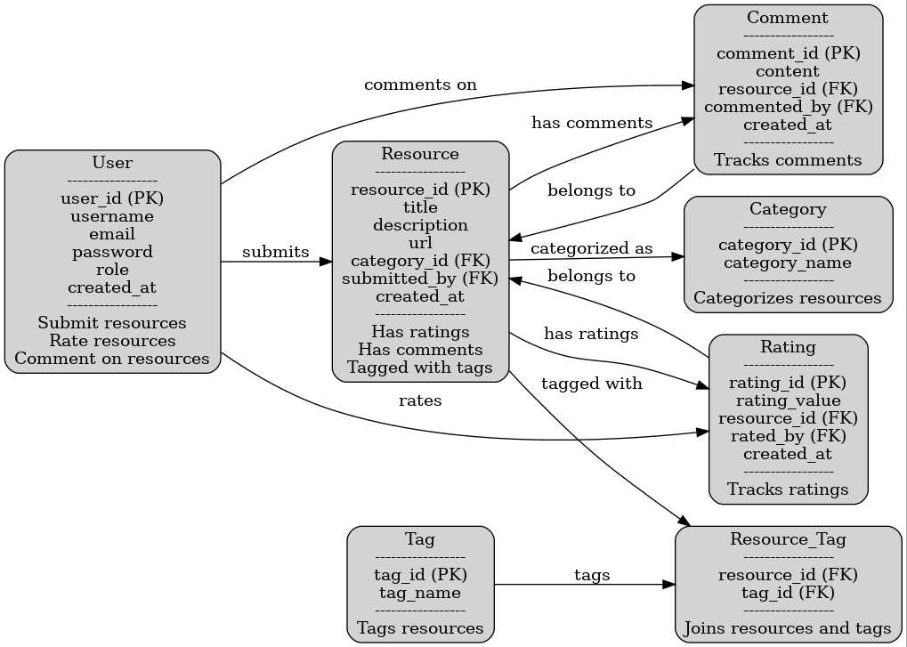

# ERD Breakdown for LazyDog

## Entities and Attributes

### **User**
- **user_id** (PK): `Integer` (or `UUID`)
- **username**: `CharField`
- **email**: `EmailField`
- **password**: `CharField`
- **role**: `CharField` (e.g., can use choices for admin/user)
- **created_at**: `DateTimeField`

**Relationships**:
- **User → Resource**: One-to-Many (submits)
- **User → Rating**: One-to-Many (rates)
- **User → Comment**: One-to-Many (comments on)

---

### **Resource**
- **resource_id** (PK): `Integer` (or `UUID`)
- **title**: `CharField`
- **description**: `TextField`
- **url**: `URLField` (or `CharField` with validation)
- **category_id** (FK): `Integer` (or `UUID`)
- **submitted_by** (FK): `Integer` (or `UUID`)
- **created_at**: `DateTimeField`

**Relationships**:
- **Resource → Category**: Many-to-One (categorized as)
- **Resource → Rating**: One-to-Many (has ratings)
- **Resource → Comment**: One-to-Many (has comments)
- **Resource :left_right_arrow: Tag**: Many-to-Many (tagged with)

---

### **Category**
- **category_id** (PK): `Integer` (or `UUID`)
- **category_name**: `CharField`

**Relationships**:
- **Category → Resource**: One-to-Many (categorizes resources)

---

### **Rating**
- **rating_id** (PK): `Integer` (or `UUID`)
- **rating_value**: `Integer` (e.g., can range from 1 to 5)
- **resource_id** (FK): `Integer` (or `UUID`)
- **rated_by** (FK): `Integer` (or `UUID`)
- **created_at**: `DateTimeField`

**Relationships**:
- **Rating → Resource**: Many-to-One (belongs to resource)

---

### **Comment**
- **comment_id** (PK): `Integer` (or `UUID`)
- **content**: `TextField`
- **resource_id** (FK): `Integer` (or `UUID`)
- **commented_by** (FK): `Integer` (or `UUID`)
- **created_at**: `DateTimeField`

**Relationships**:
- **Comment → Resource**: Many-to-One (belongs to resource)

---

### **Tag**
- **tag_id** (PK): `Integer` (or `UUID`)
- **tag_name**: `CharField`

**Relationships**:
- **Tag ←→ Resource**: Many-to-Many (tags resources)

---

### **Resource_Tag**
- **resource_id** (FK): `Integer` (or `UUID`)
- **tag_id** (FK): `Integer` (or `UUID`)

**Relationships**:
- Joins resources and tags (Many-to-Many)
