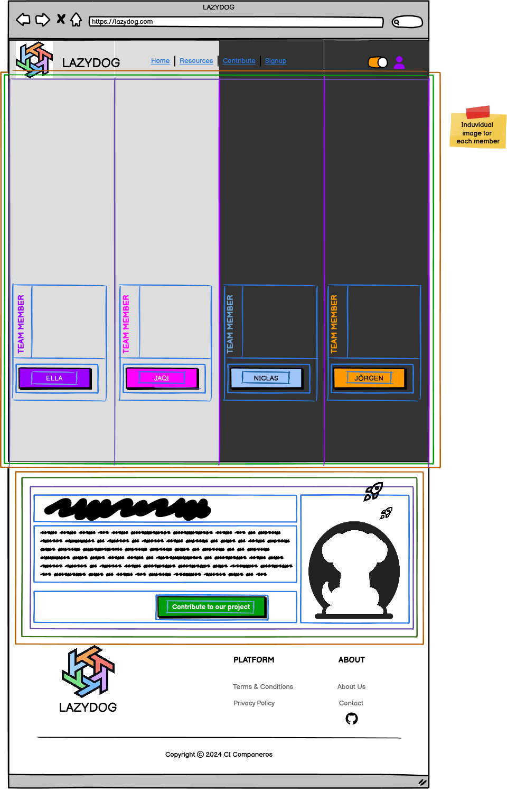

# About Page Component Guide

## AboutPage (Parent Component)

### Purpose

Introduces the project and team members, allowing users to view individual member details and contribute to the project.

### State Management

* `teamMembers` (array):  Array of team member objects.  Each object contains `name`, `role`, `image`, `bio`, `detailLink`, and `theme` (background color).
* `hoveredMember` (string | null):  The name of the currently hovered team member (for hover effects).
* `isContributing` (boolean):  True if the "Contribute" button is clicked.

### Child Components

| Component          | Location                      | Props                                   | Purpose                                                           | Data Source           |
|---------------------|-------------------------------|----------------------------------------|-------------------------------------------------------------------|-----------------------|
| Navbar              | `/src/components/Navbar`       | `onNavigate`                             | Main navigation bar (or BackToHomeButton)                            | N/A                   |
| TeamMembersSection | `/src/pages/About/TeamMembers` | `teamMembers`, `onNavigate`             | Displays team members with hover effects and navigation to detail pages | API call (via hook)  |
| ProjectOverviewSection | `/src/pages/About/ProjectOverview` | None                                   | Provides project overview and contribution button                       | Static data or API call |

**Child Components of `TeamMembersSection`:**

* `TeamMemberCard`: Displays a single team member.

## Hierarchical Diagram

```bash
AboutPage
├── TeamMembersSection
│   └── TeamMemberCard
└── ProjectOverviewSection
```

---

<details>
<summary><strong>Color System for color mapping</strong></summary>

<br>

   1. **🟧 Orange = Sections**  
      * Large areas dividing the page into logical parts (e.g., header, footer, main content).

   2. **🟩 Green = Groups of elements**  
      * Collections of related modules or components, such as the category buttons or the list of resource cards.

   3. **🟪 Purple = Modules (Self-contained units)**  
      * Complete components that combine several parts, such as a resource card or a widget. These function as cohesive, standalone units.

   4. **🟦 Blue = Parts of modules**  
      * The individual elements that make up a module, such as buttons, text, ratings, or links.

   5. **🟨 Yellow = Expandable areas**  
      * Dropdown menus and sections that can be shown/hidden based on user interaction.

   6. **🟥 Red = Dynamic content**  
      * Content that can update in real time (e.g., number of views, star ratings, user information).

</details>

<br>



---

## Communication Flow

* `teamMembers` data (fetched via `useFetchTeamMembers` custom hook) is passed to `TeamMembersSection`.
* `TeamMembersSection` handles hover effects on `TeamMemberCard` components, updating the `hoveredMember` state.
* Clicking a team member triggers navigation to the detail page via `onNavigate` (React Router).
* Clicking the "Contribute" button updates `isContributing` and redirects to the contribution page.

## Data Fetching and Hover Effects

* **Data Fetching:** The `teamMembers` data is fetched using a custom hook:  `useFetchTeamMembers()`.  Error handling is implemented within this hook.

* **Hover Effects:** Hover effects on `TeamMemberCard` components are implemented using CSS transitions or a JavaScript animation library like Framer Motion.  The `theme` property in each `teamMember` object determines the background color.

---
