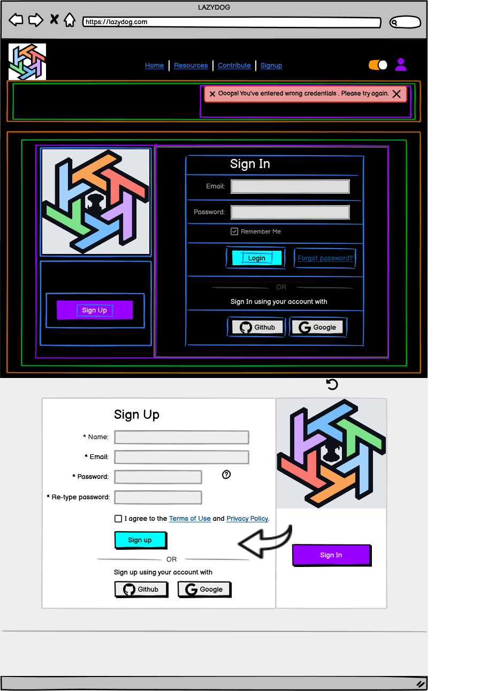

# Authentication Page Component Breakdown

## AuthPage (Parent Component)

### Purpose

Provides an animated login and signup experience, handling user authentication via email/password and OAuth, and displaying success messages after successful authentication.

### State Management

* `authMode` (string): 'login' or 'signup', controls which form is displayed.
* `errorMessage` (string | null): Error message from authentication attempts.
* `successMessage` (string | null): Success message after successful authentication.
* `isSubmitting` (boolean): True during form submission.
* `user` (object | null): User data after successful login (could be managed in `AuthContext`).

### Child Components

| Component             | Location                             | Props                                                            | Purpose                                                                                                 |
|----------------------|--------------------------------------|-----------------------------------------------------------------|---------------------------------------------------------------------------------------------------------|
| BackToHomeButton      | `/src/components/BackToHomeButton`     | `onNavigate`                                                        | Button to navigate back to home page                                                                     |
| AuthModeToggle        | `/src/pages/Auth/AuthModeToggle`       | `authMode`, `onChangeAuthMode`                                       | Animated toggle between login and signup                                                              |
| AuthFormContainer     | `/src/pages/Auth/AuthFormContainer`   | `authMode`, `onSubmit`, `onOAuthLogin`, `error`, `successMessage`, `isSubmitting` | Handles form submission, OAuth logins, displays error and success messages                             |
| AuthLogo              | `/src/components/AuthLogo`            | None                                                              | Displays the LazyDog logo                                                                                |

**Child Components of `AuthFormContainer`:**

* `LoginForm`: Email & Username, password fields, login button, "Remember Me," "Forgot Password?" link, OAuth buttons.
* `SignupForm`: Username, email, password, retype-password fields, signup button, terms of service checkbox, OAuth buttons.
* `ErrorMessage`: Displays the `errorMessage` (conditionally rendered).
* `SuccessMessage`: Displays the `successMessage` (conditionally rendered).

---

## Hierarchical Diagram

```bash
AuthPage
├── BackToHomeButton
├── AuthModeToggle
└── AuthFormContainer
    ├── LoginForm
    ├── SignupForm
    ├── ErrorMessage
    └── SuccessMessage
```

---

<details>
<summary><strong>Color System for color mapping</strong></summary>

<br>

   1. **🟧 Orange = Sections**  
      * Large areas dividing the page into logical parts (e.g., header, footer, main content).

   2. **🟩 Green = Groups of elements**  
      * Collections of related modules or components, such as the category buttons or the list of resource cards.

   3. **🟪 Purple = Modules (Self-contained units)**  
      * Complete components that combine several parts, such as a resource card or a widget. These function as cohesive, standalone units.

   4. **🟦 Blue = Parts of modules**  
      * The individual elements that make up a module, such as buttons, text, ratings, or links.

   5. **🟨 Yellow = Expandable areas**  
      * Dropdown menus and sections that can be shown/hidden based on user interaction.

   6. **🟥 Red = Dynamic content**  
      * Content that can update in real time (e.g., number of views, star ratings, user information).

</details>

<br>



---

## Communication Flow

* `AuthModeToggle` updates the `authMode` state, triggering a conditional render of `LoginForm` or `SignupForm`.

* Form submissions (`onSubmit`) handle authentication via API calls.  Success updates the `successMessage` state; errors update the `errorMessage` state.  Both `successMessage` and `errorMessage` are managed in `AuthFormContainer`.

* OAuth logins (`onOAuthLogin`) use appropriate OAuth libraries and update `successMessage` or `errorMessage` accordingly. The animation in `AuthModeToggle` is handled internally by the component.

* Successful login updates the `user` state (potentially in `AuthContext`). The `BackToHomeButton` uses `onNavigate` (React Router's `navigate` function) to redirect to the home page.

## Animation

The animation between login and signup modes (`AuthModeToggle`) could be implemented using CSS transitions or a JavaScript animation library like Framer Motion.

The specific implementation would depend on the desired visual effect.

*Remember that the implementation details for API calls, animation, and error/success message handling would reside within the respective components* (`AuthFormContainer`, `AuthModeToggle`).

---
