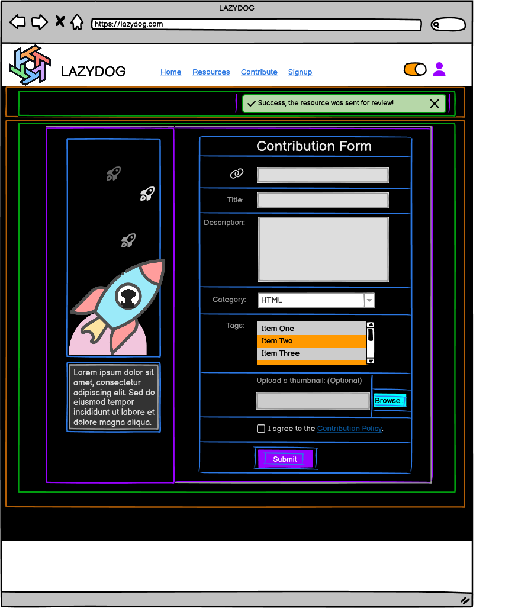

# Contribution Page Component Breakdown

## ContributionPage (Parent Component)

### Purpose

Allows users to submit resources, displaying success or error messages after submission.

### State Management

* `formData` (object): Form data (title, description, category, tags, thumbnail).
* `formErrors` (object): Errors for each form field.
* `isSubmitting` (boolean): True while submitting.
* `successMessage` (string | null): Success message after successful submission.
* `errorMessage` (string | null): Error message after failed submission.
* `categories` (array): List of available categories (fetched via API).
* `tags` (array): List of available tags (fetched via API).

### Child Components

| Component             | Location                               | Props                                                    | Purpose                                                                         | Data Source      |
|----------------------|----------------------------------------|---------------------------------------------------------|---------------------------------------------------------------------------------|-------------------|
| BackToHomeButton      | `/src/components/BackToHomeButton`     | `onNavigate`                                           | Navigates back to the home page.                                                 | N/A              |
| AnimatedSection       | `/src/pages/Contribution/AnimatedSection` | None                                                    | Animated section (rocket graphic, possibly using Framer Motion)                | N/A              |
| ContributionFormSection | `/src/pages/Contribution/ContributionForm` | `categories`, `tags`, `onSubmit`, `formData`, `formErrors`          | Handles the resource submission form                                           | API calls (hooks) |
| SuccessMessage        | `/src/components/SuccessMessage`       | `successMessage`                                           | Displays success message (conditionally rendered)                            | `ContributionFormSection` |
| ErrorMessage          | `/src/components/ErrorMessage`         | `errorMessage`                                          | Displays error message (conditionally rendered)                              | `ContributionFormSection` |

**Child Components of `ContributionFormSection`:**

* `TitleInput`
* `DescriptionTextarea`
* `CategoryDropdown`
* `TagsMultiselect`
* `ThumbnailInput`
* `PolicyCheckbox`
* `SubmitButton`

## Hierarchical Diagram

```bash
ContributionPage
├── BackToHomeButton
├── AnimatedSection
└── ContributionFormSection
    ├── TitleInput
    ├── DescriptionTextarea
    ├── CategoryDropdown
    ├── TagsMultiselect
    ├── ThumbnailInput
    ├── PolicyCheckbox
    └── SubmitButton
    ├── SuccessMessage
    └── ErrorMessage
```

---

<details>
<summary><strong>Color System for color mapping</strong></summary>

<br>

   1. **🟧 Orange = Sections**  
      * Large areas dividing the page into logical parts (e.g., header, footer, main content).

   2. **🟩 Green = Groups of elements**  
      * Collections of related modules or components, such as the category buttons or the list of resource cards.

   3. **🟪 Purple = Modules (Self-contained units)**  
      * Complete components that combine several parts, such as a resource card or a widget. These function as cohesive, standalone units.

   4. **🟦 Blue = Parts of modules**  
      * The individual elements that make up a module, such as buttons, text, ratings, or links.

   5. **🟨 Yellow = Expandable areas**  
      * Dropdown menus and sections that can be shown/hidden based on user interaction.

   6. **🟥 Red = Dynamic content**  
      * Content that can update in real time (e.g., number of views, star ratings, user information).

</details>

<br>



---

## Communication Flow

* Form data changes update the `formData` state in `ContributionFormSection`.

* Form submission (`onSubmit`) triggers an API call (handled internally in `ContributionFormSection` using a custom hook, e.g., `useSubmitResource`).

* API response updates `successMessage` or `errorMessage` which triggers a conditional render of the success or error messages.

* The animation in `AnimatedSection` is handled independently by that component.  The `BackToHomeButton` uses the `onNavigate` prop (React Router's `navigate` function) to redirect to the home page.

## Animation

The animation in the `AnimatedSection` could use CSS transitions or a JavaScript animation library like Framer Motion. The specifics depend on our design.

---
