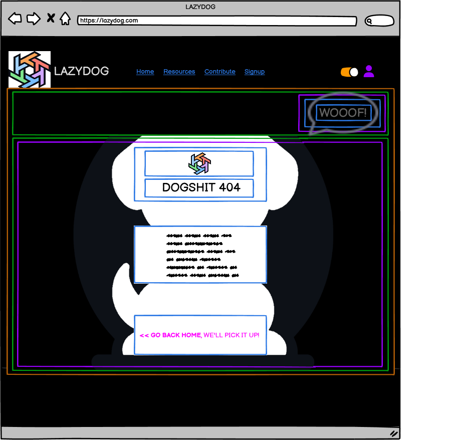

# Error Pages Component Breakdown

## ErrorPage (Parent Component)

### Purpose

Displays user-friendly error messages with relevant graphics and a redirect option.

### State Management

* `errorCode` (number): The HTTP error code (e.g., 404).
* `redirectPath` (string): The URL to redirect to (default: `/`).

### Error Mapping Example (If not Django Errors are used)

This mapping can be stored in a separate file or within the component:

```javascript
const errorMap = {
  404: {
    graphic: '/images/dog-404.svg',
    message: "Dogshit 404: Page Not Found",
    speechBubble: "Woof!",
  },
  500: {
    graphic: '/images/server-error.svg',
    message: "Server Error: Something went wrong on our end!",
    speechBubble: "Oops!",
  },
  // Add more error types as needed...
};
```

### Child Components

| Component          | Location                        | Props                                  | Purpose                                                                        |
|----------------------|---------------------------------|---------------------------------------|---------------------------------------------------------------------------------|
| ErrorGraphic        | `/src/components/ErrorGraphic` | `graphic` (from `errorMap`)            | Displays an error-specific graphic                                                |
| ErrorCodeDisplay    | `/src/components/ErrorCodeDisplay` | `errorCode`                             | Displays the error code (e.g., 404)                                            |
| ErrorMessage        | `/src/components/ErrorMessage` | `message` (from `errorMap`)           | Displays a user-friendly error message                                          |
| SpeechBubble        | `/src/components/SpeechBubble` | `speechBubble` (from `errorMap`)       | Displays a thematic speech bubble                                               |
| RedirectButton      | `/src/components/RedirectButton` | `redirectPath`, `buttonText` (optional) | Provides a button to redirect to another page; customizable button text.           |

## Hierarchical Diagram

```bash
ErrorPage
├── ErrorGraphic
├── ErrorCodeDisplay
├── ErrorMessage
├── SpeechBubble
└── RedirectButton
```

---

<details>
<summary><strong>Color System for color mapping</strong></summary>

<br>

   1. **🟧 Orange = Sections**  
      * Large areas dividing the page into logical parts (e.g., header, footer, main content).

   2. **🟩 Green = Groups of elements**  
      * Collections of related modules or components, such as the category buttons or the list of resource cards.

   3. **🟪 Purple = Modules (Self-contained units)**  
      * Complete components that combine several parts, such as a resource card or a widget. These function as cohesive, standalone units.

   4. **🟦 Blue = Parts of modules**  
      * The individual elements that make up a module, such as buttons, text, ratings, or links.

   5. **🟨 Yellow = Expandable areas**  
      * Dropdown menus and sections that can be shown/hidden based on user interaction.

   6. **🟥 Red = Dynamic content**  
      * Content that can update in real time (e.g., number of views, star ratings, user information).

</details>

<br>



---

## Communication Flow

* The `errorCode` determines which data is retrieved from the `errorMap`.
* Data from `errorMap` is passed as props to child components.
* The `RedirectButton` handles navigation using React Router.

---
