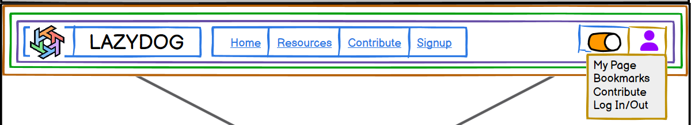

# Navbar Component Guide

## Navbar (Component)

### Purpose

The Navbar component provides top-level navigation for the LazyDog application. It displays the application logo, primary navigation links, and user authentication/profile controls.  It adapts its appearance based on the user's authentication status and the current theme (light or dark mode).

### State Management (Context API)

The Navbar does *not* manage its own internal state. Instead, it leverages the following context providers:

* **`AuthContext`:**  Provides the user's authentication status (`user` object or `null`).  The Navbar uses this to conditionally render the user profile section.
* **`ThemeContext`:** Provides the current theme (`darkMode` boolean). The Navbar uses this to apply appropriate styling (dark or light theme).

### Props

The Navbar component does not require any props.  It obtains all necessary data from context providers.

### Child Components

The Navbar is composed of several sub-components for better organization and reusability:

| Child Component      | Purpose                                                         | Data Source      |
|----------------------|-----------------------------------------------------------------|-------------------|
| `Logo`               | Displays the LazyDog logo (clickable link to the homepage).        | N/A              |
| `NavigationLinks`   | Displays primary navigation links ("Home", "Resources", "Contribute", "Signup"). | N/A              |
| `UserControls`       | Displays user-specific controls (login/signup buttons or user profile). | `AuthContext`     |
| `ThemeToggleButton` | Provides a toggle for switching between light and dark modes.        | `ThemeContext`   |

**Child Components of `UserControls` (Conditional Rendering):**

* **Logged-out:**
  * `LoginButton`: A button linking to the login page.
  * `SignupButton`: A button linking to the signup page.

* **Logged-in:**
  * `UserProfileDropdown`: A dropdown menu that appears when the user's profile icon is clicked. This dropdown includes links to "My Page," "Bookmarks," "Contribute," and a "Log Out" button.

## Hierarchical Diagram

```bash
Navbar
├── Logo
├── NavigationLinks
└── UserControls
    ├── LoginButton (logged-out)
    ├── SignupButton (logged-out)
    └── UserProfileDropdown (logged-in)
        ├── MyPageLink
        ├── BookmarksLink
        ├── ContributeLink
        └── LogoutButton

```

<details>
<summary><strong>Color System for color mapping</strong></summary>

<br>

   1. **🟧 Orange = Sections**  
      * Large areas dividing the page into logical parts (e.g., header, footer, main content).

   2. **🟩 Green = Groups of elements**  
      * Collections of related modules or components, such as the category buttons or the list of resource cards.

   3. **🟪 Purple = Modules (Self-contained units)**  
      * Complete components that combine several parts, such as a resource card or a widget. These function as cohesive, standalone units.

   4. **🟦 Blue = Parts of modules**  
      * The individual elements that make up a module, such as buttons, text, ratings, or links.

   5. **🟨 Yellow = Expandable areas**  
      * Dropdown menus and sections that can be shown/hidden based on user interaction.

   6. **🟥 Red = Dynamic content**  
      * Content that can update in real time (e.g., number of views, star ratings, user information).

</details>

<br>



---

## Communication Flow

The Navbar passively receives data from the `AuthContext` and `ThemeContext` to render its UI appropriately.  User interactions (clicking navigation links, the theme toggle, or the user profile dropdown) trigger navigation using `useNavigate` from React Router or update the relevant context (e.g., logging out via the `AuthContext` methods).

## Styling

The Navbar's styling should be designed in "Glasmorphism" and to be responsive and adapt to different screen sizes. The styling should also dynamically adjust based on the `darkMode` value provided by `ThemeContext`.

---
