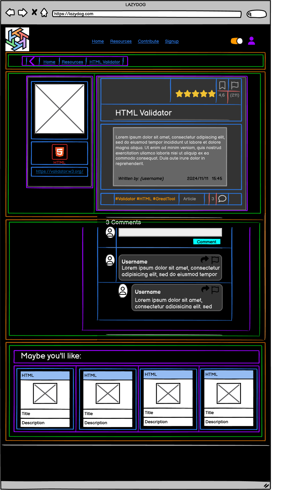

# Resource Detail Page Component Breakdown

## ResourceDetailPage (Parent Component)

### Purpose

Displays detailed resource information, comments, and related resources.

### State Management (Using Context API)

 **`ResourceDetailContext`:** Manages `resource`, `comments`, `relatedResources`, `isLoading`, `error`.

### Child Components

| Component              | Location                                   | Props                                             | Purpose                                                                  | Data Source                       |
|------------------------|-------------------------------------------|--------------------------------------------------|--------------------------------------------------------------------------|-----------------------------------|
| NavSection             | `/src/components/NavSection`             | `breadcrumbs`, `onNavigate`                         | Breadcrumbs and back navigation                                           |  N/A                               |
| ResourceDetailsComponent | `/src/pages/ResourceDetail/ResourceDetails` | Accesses `ResourceDetailContext`, `onNavigate`  | Displays main resource details                                             | `ResourceDetailContext`          |
| CommentSection         | `/src/pages/ResourceDetail/Comments`      | Accesses `ResourceDetailContext`                   | Manages comments (display, submission)                                     | `ResourceDetailContext`          |
| RecommendedResourcesSection | `/src/pages/ResourceDetail/Recommendations` | `recommendedResources` (from `ResourceDetailContext`), `onNavigate` | Displays related resources                                                   | `ResourceDetailContext`          |

---

**Child Components of `ResourceDetailsComponent`:**

* `ResourceImageComponent`: Displays the resource image.
* `ResourceTitleComponent`: Displays the resource title and link.
* `ResourceDescriptionComponent`: Shows the resource description.
* `ResourceMetadataComponent`: Displays metadata (rating, comments, author, date).

**Child Components of `CommentSection`:**

* `CommentList`
  * `CommentItem`: Displays a single comment.
* `CommentForm`: Allows submitting new comments.

---

## Hierarchical Diagram

```bash
ResourceDetailPage
├── NavSection
├── ResourceDetailsComponent
│   ├── ResourceImageComponent
│   ├── ResourceTitleComponent
│   ├── ResourceDescriptionComponent
│   └── ResourceMetadataComponent
├── CommentSection
│   ├── CommentList
│   │   └── CommentItem
│   └── CommentForm
└── RecommendedResourcesSection
    └── ResourceItem  (or similar component for displaying recommendations)
```

---

<details>
<summary><strong>Color System for color mapping</strong></summary>

<br>

   1. **🟧 Orange = Sections**  
      * Large areas dividing the page into logical parts (e.g., header, footer, main content).

   2. **🟩 Green = Groups of elements**  
      * Collections of related modules or components, such as the category buttons or the list of resource cards.

   3. **🟪 Purple = Modules (Self-contained units)**  
      * Complete components that combine several parts, such as a resource card or a widget. These function as cohesive, standalone units.

   4. **🟦 Blue = Parts of modules**  
      * The individual elements that make up a module, such as buttons, text, ratings, or links.

   5. **🟨 Yellow = Expandable areas**  
      * Dropdown menus and sections that can be shown/hidden based on user interaction.

   6. **🟥 Red = Dynamic content**  
      * Content that can update in real time (e.g., number of views, star ratings, user information).

</details>

<br>



---

## Communication Flow

* `ResourceDetailContext` provides data (fetched via custom hooks: `useFetchResource`, `useFetchComments`, `useFetchRecommendations`).
* User interactions (comment submission) update the context, triggering re-renders.
* Navigation is handled by React Router.  Error handling is implemented within the custom hooks.

---
