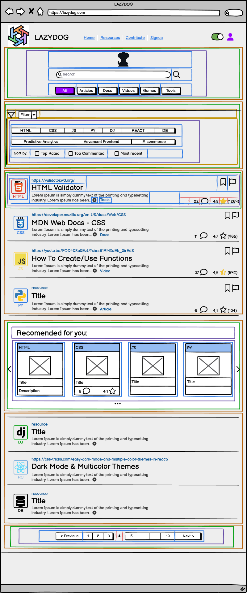

# Resource Page Component Breakdown

## ResourcePage (Parent Component)

### Purpose

Manages resource display, search, filtering, and pagination.

### State Management (Using Context API)

- **`ResourceContext`:**
  - Manages `resources`, `isLoading`, `error`,
  - search parameters (`searchQuery`, `categoryFilters`, `industryFilters`, `sortBy`),
  - and pagination state (`currentPage`, `totalPages`).

### Functions (mostly handled within custom hooks)

- `useFetchResources` (custom hook): Fetches resources based on the context's filter and pagination state.

### Child Components

| Component             | Location                                  | Props                                                    | Purpose                                                                   | Data Source                     |
|----------------------|------------------------------------------|---------------------------------------------------------|---------------------------------------------------------------------------|---------------------------------|
| SearchAndFilterSection | `/src/pages/Resources/SearchFilterSection` | Accesses `ResourceContext`, `onSearch`, `onFilterChange`, `onSortChange` | Handles search and filtering UI                                            | N/A                              |
| ResourceList          | `/src/pages/Resources/ResourceList`      | `resources` (from `ResourceContext`)                     | Displays the list of resources                                             | `ResourceContext`             |
| RecommendationCarousel | `/src/components/Carousel`                 | `recommendedResources` (from `ResourceContext`), `onNavigate`       | Displays recommended resources                                               | `ResourceContext`             |
| Pagination            | `/src/components/Pagination`             | `currentPage`, `totalPages`, `onPageChange` (updates `ResourceContext`) | Handles pagination                                                    | `ResourceContext`             |
| ResourceItem         | `/src/components/ResourceItem`          | `resource`, `onNavigate` (React Router function)           | Displays a single resource; title, description, category, rating, comments | `ResourceList`  or `RecommendationCarousel`              |

---

**SearchAndFilterSection Child Components:**

- `SearchBar`
- `CategoryFilter`
- `IndustryFilter`
- `SortOptions`

## Hierarchical Diagram

```bash
ResourcePage
├── SearchAndFilterSection
│   ├── SearchBar
│   ├── CategoryFilter
│   ├── IndustryFilter
│   └── SortOptions
├── ResourceList
│   └── ResourceItem
├── RecommendationCarousel
│   └── RecommendationItem (if different from ResourceItem)
└── Pagination
```

---

<details>
<summary><strong>Color System for color mapping</strong></summary>

<br>

   1. **🟧 Orange = Sections**  
      * Large areas dividing the page into logical parts (e.g., header, footer, main content).

   2. **🟩 Green = Groups of elements**  
      * Collections of related modules or components, such as the category buttons or the list of resource cards.

   3. **🟪 Purple = Modules (Self-contained units)**  
      * Complete components that combine several parts, such as a resource card or a widget. These function as cohesive, standalone units.

   4. **🟦 Blue = Parts of modules**  
      * The individual elements that make up a module, such as buttons, text, ratings, or links.

   5. **🟨 Yellow = Expandable areas**  
      * Dropdown menus and sections that can be shown/hidden based on user interaction.

   6. **🟥 Red = Dynamic content**  
      * Content that can update in real time (e.g., number of views, star ratings, user information).

</details>

<br>



---

## Communication Flow

- `ResourceContext` provides data to child components.
- User interactions (search, filtering, sorting, pagination) update the `ResourceContext`, triggering re-renders via `useFetchResources`.
- Navigation to detail pages is handled by React Router.

---
