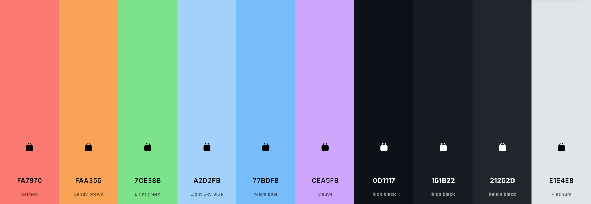
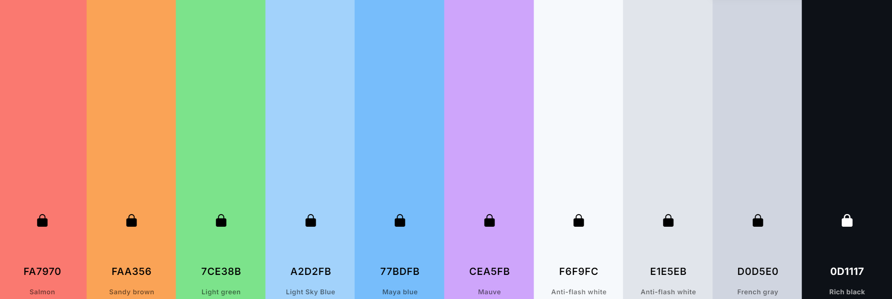

# Color Palette Usage for LazyDog

1. **Salmon (#FA7970)** - Error Color  
   **Usage:**  
   - Error messages, validation alerts, or warnings.  
   - Error states in forms (e.g., when a required field isn’t filled in).  
   - Critical notifications that need immediate user attention.  
   **Example:**  
   If a user submits a form with missing required fields, the form field borders and error messages could use this color.

2. **Light Green (#7CE38B)** - Success Color  
   **Usage:**  
   - Success notifications (e.g., successful submission of forms, completed actions).  
   - Status indicators showing positive outcomes.  
   **Example:**  
   When a user submits a resource successfully, a message pops up in this color.

3. **Maya Blue (#77BDFB)** - Interactive/Important Elements  
   **Usage:**  
   - Links, interactive elements, and hover states.  
   - Icons for actions like saving, editing, or opening a link.  
   - Highlighting buttons for primary actions, making them stand out against the dark background.  
   **Example:**  
   The "Submit" or "Next" button on your forms could use this color, especially in dark mode, with hover states slightly lightened.

4. **Mauve (#CEA5FB)** - Accent/Creative Touches  
   **Usage:**  
   - Accent color for key sections where you want to draw attention creatively (e.g., featured cards, team member highlights).  
   - Background color for buttons in dark mode to give them a modern, playful feel.  
   - Hover states or transitions (hovering over a card might show a mauve shadow or border).  
   **Example:**  
   A button that opens a modal or a key call-to-action could have a subtle mauve background with dark text on top.

5. **Light Sky Blue (#A2D2FB)** - Subtle Highlights  
   **Usage:**  
   - Background color for form inputs, cards, or sections in light mode where you want a clean, light look.  
   - Could be used as a background in notifications or banners that don’t require immediate attention (e.g., information pop-ups).  
   **Example:**  
   Text input fields could have this background to contrast with the rest of the content in a way that’s calming and easy on the eyes.

6. **Sandy Brown (#FAA356)** - Subtle CTAs/Dividers  
   **Usage:**  
   - Calls-to-action that aren't primary but still need attention (e.g., "Learn more," "See more details").  
   - Accent color in headers, footers, or dividers.  
   - Background color for less prominent notification banners.  
   **Example:**  
   A "Learn more" button at the bottom of a card or as a dividing line between sections on a page, giving a warm, subtle contrast.

## Dark Mode Palette

---

## Light Mode Palette
