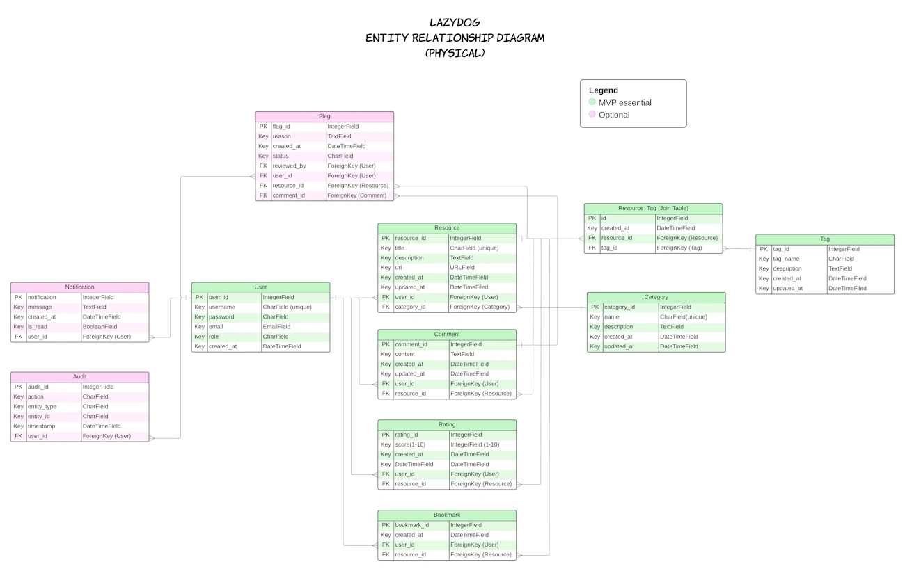

<!-- markdownlint-disable MD033 MD036 -->
# Lazydog Models & ERD relationships

## Content

- [Models](#models)
- [Relationship](#erd-relationships-explained)
- [Minimum Viable Product](#minimum-viable-product)
- [Diagram image](#diagram-image)

## Models

### User model

This model defines users on the platform. It includes attributes such as username, password, email, and creation date. Each user can interact with the platform by submitting resources, commenting, rating, flagging inappropriate content, and bookmarking resources for later reference. Additionally, a `role` field differentiates regular users from admins who can review flagged content.

| Attribute   | Type                   | Description                                 |
|-------------|------------------------|---------------------------------------------|
| user_id     | IntegerField (PK)      | Primary Key                                 |
| username    | CharField (unique)     | Unique Username                             |
| password    | CharField              | User Password                               |
| email       | EmailField             | User Email Address                          |
| role        | CharField              | Role of the user (e.g., "User," "Admin")    |
| created_at  | DateTimeField          | Account Creation Date                       |

### Resource model

The Resource model represents learning resources added to the platform. Each resource includes a title, description, URL, and is categorized by category. Resources are also linked to the user who submitted them, enabling users to engage with and contribute valuable content.

| Attribute    | Type                  | Description                                 |
|--------------|-----------------------|---------------------------------------------|
| resource_id  | IntegerField (PK)     | Primary Key                                 |
| title        | CharField             | Title of the Resource                       |
| description  | TextField             | Detailed Description of the Resource        |
| category_id  | ForeignKey (Category) | Reference to Related Category               |
| user_id      | ForeignKey (User)     | Reference to the User who Submitted It      |
| url          | URLField              | URL of the Resource                         |
| created_at   | DateTimeField         | Resource Creation Date                      |
| updated_at   | DateTimeField         | Resource Last Updated Date                  |

### Comment model

This model allows users to leave feedback on resources through comments. Each comment is linked to a user and a specific resource, and includes content along with timestamps for creation and updates.

| Attribute    | Type                  | Description                                 |
|--------------|-----------------------|---------------------------------------------|
| comment_id   | IntegerField (PK)     | Primary Key                                 |
| user_id      | ForeignKey (User)     | Reference to the User who Wrote the Comment |
| resource_id  | ForeignKey (Resource) | Reference to the Related Resource           |
| content      | TextField             | The Comment Text                            |
| created_at   | DateTimeField         | Comment Creation Date                       |
| updated_at   | DateTimeField         | Comment Last Updated Date                   |

### Rating model

The Rating model lets users rate resources, providing a simple integer score (e.g., from 1 to 5) for each resource. This model links ratings to both users and resources, helping to rank and highlight valuable content.

| Attribute    | Type                  | Description                                 |
|--------------|-----------------------|---------------------------------------------|
| rating_id    | IntegerField (PK)     | Primary Key                                 |
| user_id      | ForeignKey (User)     | Reference to the User who Gave the Rating   |
| resource_id  | ForeignKey (Resource) | Reference to the Related Resource           |
| score        | IntegerField          | Rating Score (e.g., 1-5)                    |
| created_at   | DateTimeField         | Rating Creation Date                        |
| updated_at   | DateTimeField         | Rating Last Updated Date                    |

### Category model

The Category model categorizes resources, helping users navigate content based on specific topics or areas of interest. Each category has a unique name and description, which aids in resource organization.

| Attribute    | Type                  | Description                                 |
|--------------|-----------------------|---------------------------------------------|
| category_id  | IntegerField (PK)     | Primary Key                                 |
| name         | CharField (unique)    | Name of the Category                        |
| description  | TextField             | Description of the Category                 |
| created_at   | DateTimeField         | Category Creation Date                      |
| updated_at   | DateTimeField         | Category Last Updated Date                  |

### Tag model

Tags provide a way to add additional metadata to resources, allowing for greater flexibility in resource categorization. Tags can be associated with many resources, enabling users to find content based on specific keywords.

| Attribute    | Type                  | Description                                 |
|--------------|-----------------------|---------------------------------------------|
| tag_id       | IntegerField (PK)     | Primary Key                                 |
| name         | CharField (unique)    | Name of the Tag                             |
| description  | TextField             | Description of the Tag (Optional)           |
| created_at   | DateTimeField         | Tag Creation Date                           |
| updated_at   | DateTimeField         | Tag Last Updated Date                       |

### Resource_Tag model (Join Table)

This join table connects resources to tags, supporting many-to-many relationships between them. Each entry in this table links one resource with one tag, enabling flexible categorization and search functionality.

| Attribute    | Type                  | Description                                 |
|--------------|-----------------------|---------------------------------------------|
| id           | IntegerField (PK)     | Primary Key                                 |
| resource_id  | ForeignKey (Resource) | Reference to the Related Resource           |
| tag_id       | ForeignKey (Tag)      | Reference to the Related Tag                |
| created_at   | DateTimeField         | Timestamp when the Link was Created         |

### Flag Model

The Flag model allows users to report inappropriate or harmful content on resources or comments. This model links flags to users, resources, or comments, and provides a review mechanism for admins, including a reason and status field for flag processing.

| Attribute     | Type                  | Description                                     |
|---------------|-----------------------|-------------------------------------------------|
| flag_id       | IntegerField (PK)     | Primary Key                                     |
| user_id       | ForeignKey (User)     | Reference to the User who flagged the item      |
| resource_id   | ForeignKey (Resource) | (Optional) Reference to the flagged resource    |
| comment_id    | ForeignKey (Comment)  | (Optional) Reference to the flagged comment     |
| reason        | TextField             | Reason provided for the flag                    |
| created_at    | DateTimeField         | Date the flag was created                       |
| status        | CharField             | Status of the flag (e.g., "Pending," "Reviewed") |
| reviewed_by   | ForeignKey (User)     | Admin who reviewed the flag, if applicable      |

### Bookmark Model

The Bookmark model enables users to save resources they find valuable for easy access later. Each bookmark entry links a user to a specific resource, supporting personalized content curation and easy retrieval.

| Attribute     | Type                  | Description                                   |
|---------------|-----------------------|-----------------------------------------------|
| bookmark_id   | IntegerField (PK)     | Primary Key                                   |
| user_id       | ForeignKey (User)     | Reference to the User who bookmarked the item |
| resource_id   | ForeignKey (Resource) | Reference to the bookmarked resource          |
| created_at    | DateTimeField         | Date the bookmark was created                 |

### Notification Model (Optional)

This optional model supports notifications sent to users, such as alerts for resource approval or flag status updates. Each notification is linked to a user and has attributes to define the notification type and read status.

| Attribute        | Type                  | Description                                  |
|------------------|-----------------------|----------------------------------------------|
| notification_id  | IntegerField (PK)     | Primary Key                                  |
| user_id          | ForeignKey (User)     | Reference to the User receiving the notification |
| message          | TextField             | Content of the notification                  |
| created_at       | DateTimeField         | Notification creation date                   |
| is_read          | BooleanField          | Read status of the notification              |

### Audit Model (Optional)

This optional model helps track changes or actions taken on resources, comments, flags, etc., providing an audit trail. Each audit entry records the user performing the action, the affected entity, action type, and timestamp.

| Attribute    | Type                  | Description                                   |
|--------------|-----------------------|-----------------------------------------------|
| audit_id     | IntegerField (PK)     | Primary Key                                   |
| user_id      | ForeignKey (User)     | Reference to the User who performed the action |
| action       | CharField             | Type of action (e.g., "Flagged", "Commented") |
| entity_type  | CharField             | Type of entity affected (e.g., "Resource", "Comment") |
| entity_id    | IntegerField          | ID of the affected entity                     |
| timestamp    | DateTimeField         | Date and time of the action                   |

[Back to Content](#content)

## ERD relationships explained

**User - Resource**

- Cardinality: One (User) to Many (Resources)
- Description: A user can submit many resources, but each resource is submitted by one and only one user.

**User - Comment**

- Cardinality: One (User) to Many (Comments)
- Description: A user can write many comments, but each comment is written by one and only one user.

**Resource - Comment**

- Cardinality: One (Resource) to Many (Comments)
- Description: A resource can have many comments, but each comment is associated with one and only one resource.

**Resource - Rating**

- Cardinality: One (Resource) to Many (Ratings)
- Description: A resource can have many ratings, but each rating belongs to one and only one resource.

**User - Rating**

- Cardinality: One (User) to Many (Ratings)
- Description: A user can give many ratings, but each rating is provided by one and only one user.

**Category - Resource**

- Cardinality: One (Category) to Many (Resources)
- Description: A category can include many resources, but each resource belongs to one and only one category.

**Resource - Tag (via Resource_Tag)**

- Cardinality: Many (Resources) to Many (Tags)
- Description: A resource can have many tags, and a tag can be associated with many resources.

**Resource_Tag (Join Table)**

- Cardinalities:
  i. Resource_Tag is linked to one and only one resource.
  ii. Resource_Tag is linked to one and only one tag.

**User - Flag**

- Cardinality: One (User) to Many (Flags)
- Description: A user can flag multiple items, but each flag is associated with one user.

**Resource - Flag**

- Cardinality: One (Resource) to Many (Flags)
- Description: A resource can be flagged multiple times by different users.

**Comment - Flag**

- Cardinality: One (Comment) to Many (Flags)
- Description: A comment can be flagged multiple times by different users.

**User (Reviewer) - Flag**

- Cardinality: One (User) to Many (Flags)
- Description: An admin or reviewer can review multiple flags.

**User - Bookmark**

- Cardinality: One (User) to Many (Bookmarks)
- Description: A user can bookmark multiple resources.

**Resource - Bookmark**

- Cardinality: One (Resource) to Many (Bookmarks)
- Description: A resource can be bookmarked by multiple users.

**User - Notification**

- Cardinality: One (User) to Many (Notifications)
- Description: A user can receive multiple notifications.

**User - Audit**

- Cardinality: One (User) to Many (Audits)
- Description: A user can perform multiple actions that are recorded in the audit log.

[Back to Content](#content)

## Minimum Viable Product

For a Minimum Viable Product (MVP), the focus should be on the core functionality that allows users to interact with and manage resources. Based on this, the following models are essential:

### Essential Models for MVP

**User**

- Core for managing user accounts and authentication.
- Required for users to log in, interact with resources, and perform actions (submit, comment, rate).

**Resource**

- Fundamental for the platform, as it holds the resources users come to browse, submit, and learn from.
- Includes attributes like title, description, URL, category, and the user who submitted it.

**Category**

- Organizes resources, making it easier for users to browse by topic.
- This is critical for navigation and user experience.

**Comment**

- Allows users to engage with resources by leaving feedback.
- Comments encourage interaction and add value by letting users discuss the resource.

**Rating**

- Provides a mechanism to rate resources, helping other users see which resources are more valuable.
- Ratings are typically a core feature for any content-focused platform to indicate resource quality.

**Tag and Resource_Tag (Join Table)**

- Tags allow additional categorization and metadata for resources, enhancing search and discovery.
- The join table (`Resource_Tag`) enables the many-to-many relationship between resources and tags.

**Bookmark**

- Allows users to save resources for easy access later.
- This feature supports personalization, helping users retain resources they find valuable.

### Optional (Not Core to MVP but Add Value)

**Flag**

- Adds moderation capability by allowing users to flag inappropriate content.
- This is more critical in later stages when community-driven moderation becomes essential, but not strictly necessary in an MVP.

**Notification**

- Useful for informing users about events (e.g., comments on their resources, status updates), but not essential for initial functionality.
- Notifications can be added in a later version to enhance engagement.

**Audit**

- Logs user actions for accountability and tracking changes.
- Helpful in tracking user activity, especially as the platform scales, but not necessary for the initial launch.

## Recommended MVP Model Summary

To achieve a functional MVP, focus on the following models:

- User
- Resource
- Category
- Comment
- Rating
- Tag (and **Resource_Tag** for tag management)
- Bookmark

These models together support a basic version of the platform where users can:

- Register, log in, and view resources.
- Submit resources with categorization and tagging.
- Engage through comments and ratings.
- Bookmark resources for future reference.

Adding **Flag**, **Notification**, and **Audit** models can be considered for a later release when moderation, user engagement, and accountability become priorities as the platform grows.

[Back to Content](#content)

## Diagram image

[Back to Content](#content)

<!-- markdownlint-enable MD033 MD036 -->