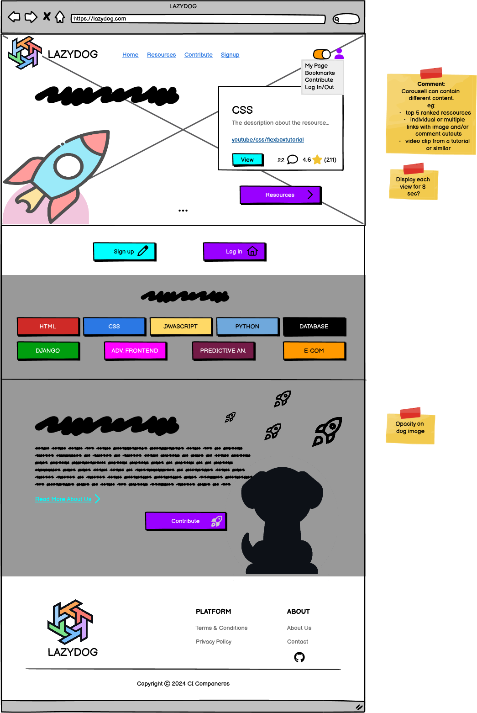
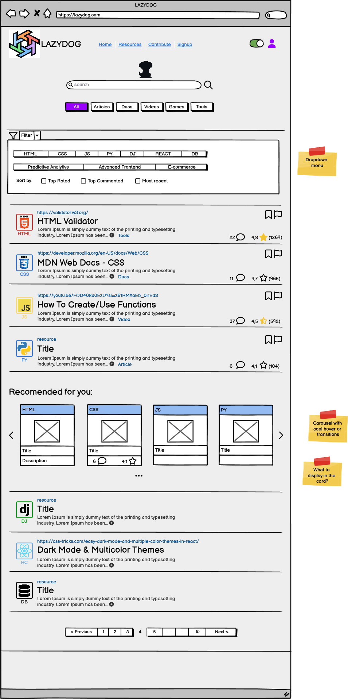
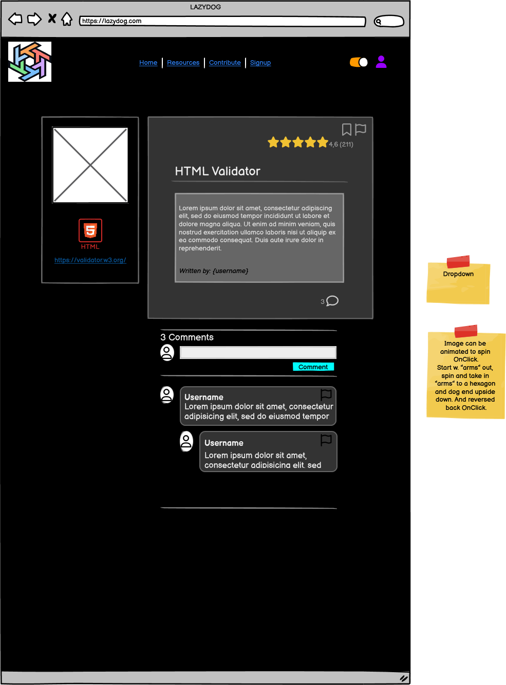
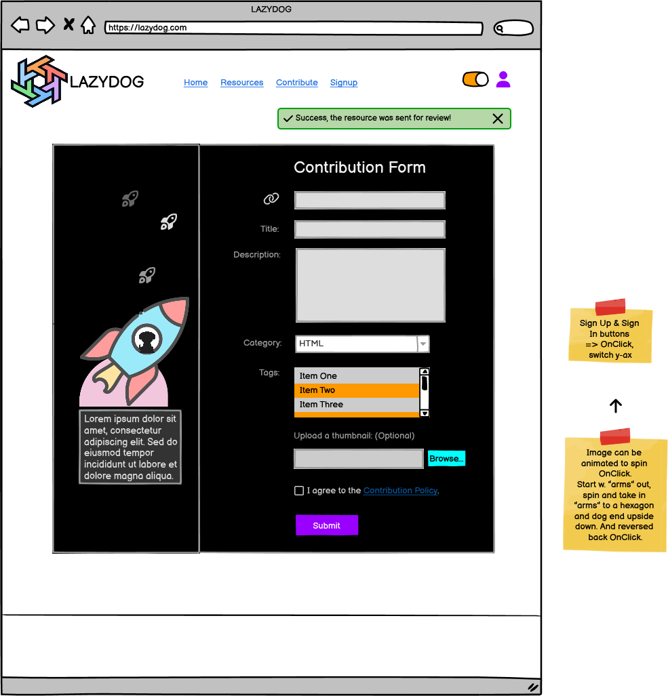
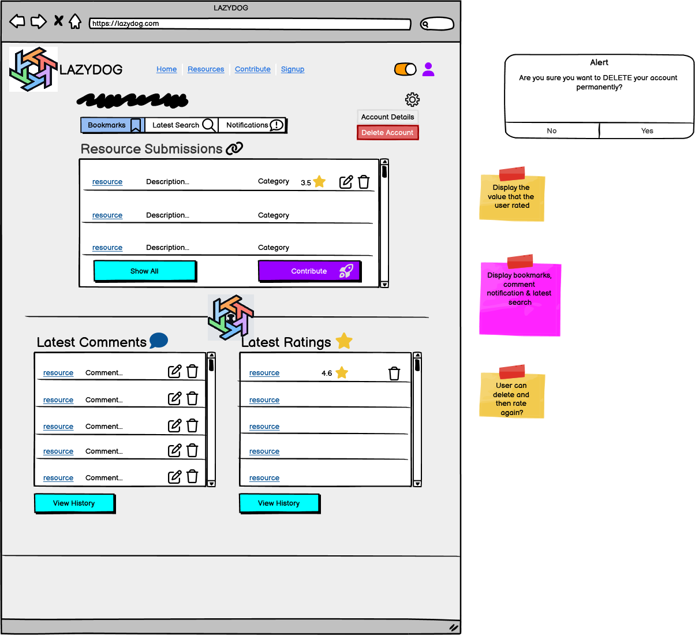
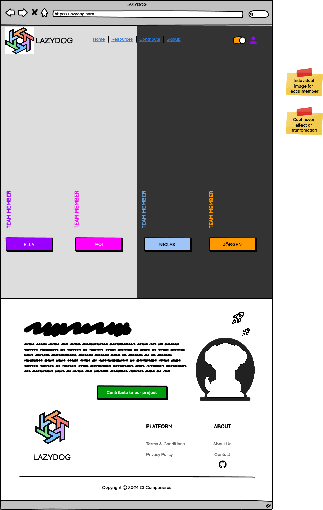
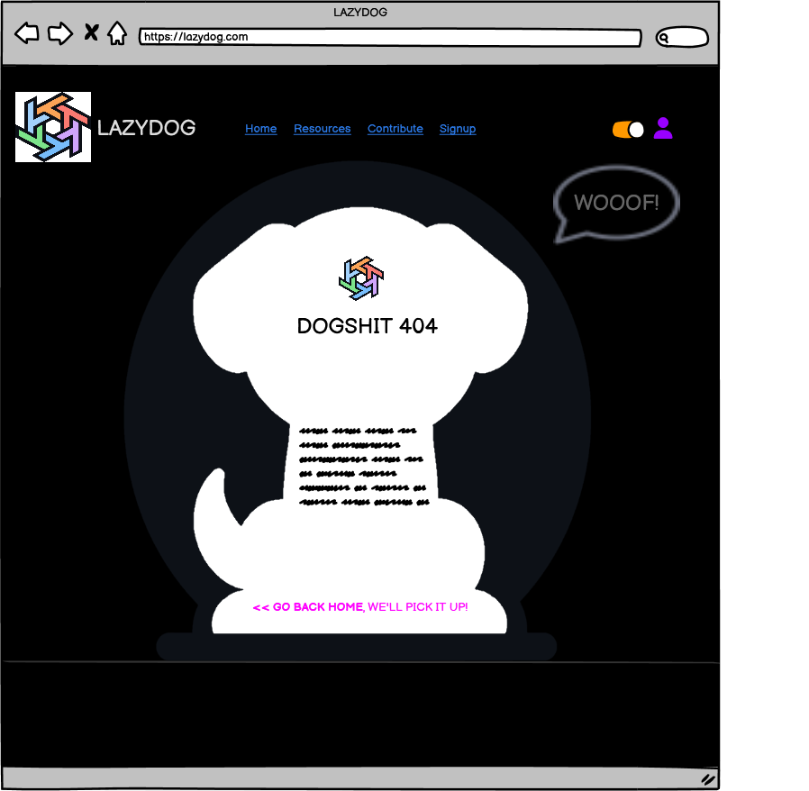
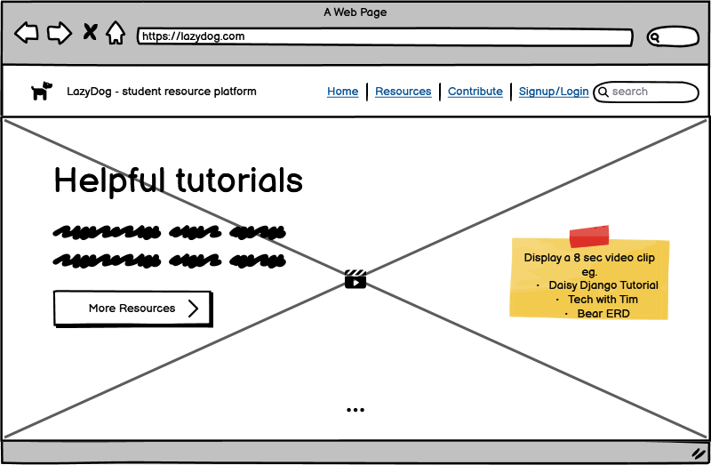
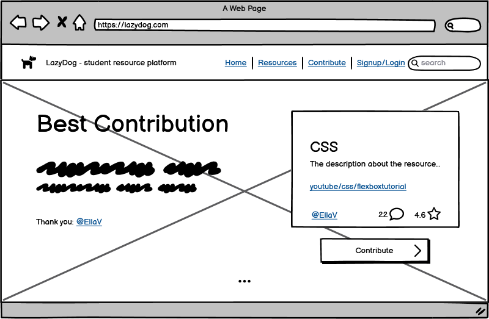
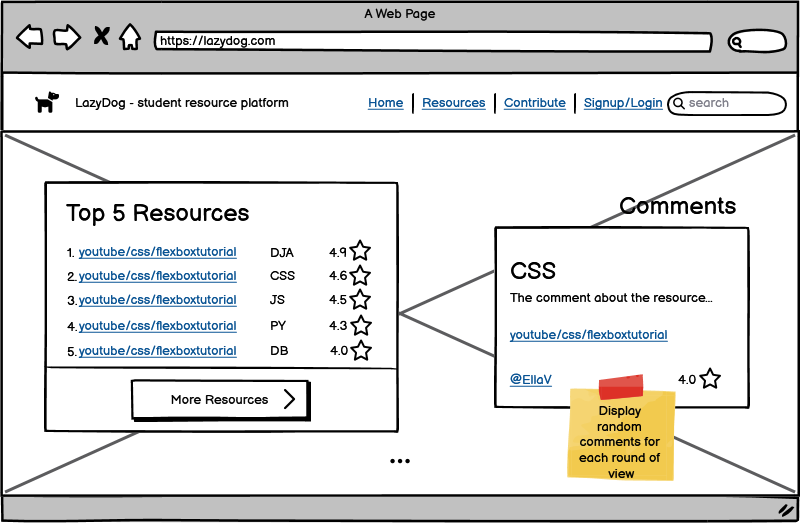

# Wireframes for LazyDog

## Desktop

Wireframe Design for Desktop

 

### Home Page

#### Sign Up & Sign In

#### Resource Page

#### Resource Detail Page

#### Contribution Page

#### User Dashboard

#### About Page

#### About Detail Page

#### Error Page

---

## Mobile

Wireframe Design for Mobile

---

## Ideas & Inspiration

Wireframes & Designs

 

### Inspiration for Carousel Sections on the Home Page

 

#### Inspiration for Navbar Section

---
