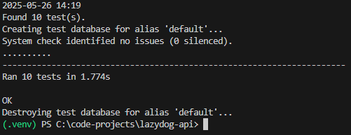
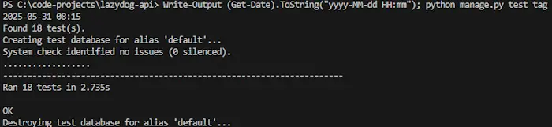

# Testing of LazyDog Platform

## Table of Contents

- [Testing of LazyDog Platform](#testing-of-lazydog-platform)
  - [Testing Overview & Environment](#testing-overview--environment)
    - [Icon Keys](#icon-keys)
    - [Test Environment](#test-environment)
    - [Browser Compatibility](#browser-compatibility)
    - [Responsiveness](#responsiveness)
  - [Code Validation](#code-validation)
    - [HTML](#html)
    - [CSS](#css)
    - [JavaScript](#javascript)
    - [Python](#python)
  - [Lighthouse](#lighthouse)
    - [Lighthouse Desktop](#lighthouse-desktop)
    - [Lighthouse Mobile](#lighthouse-mobile)
  - [User Roles & Permissions](#user-roles--permissions)
  - [Automated Testing](#automated-testing)
    - [Bookmark API](#bookmark-api-test-coverage-automated)
    - [Category API](#category-api-test-coverage-automated)
    - [Comment API](#comment-api-test-coverage-automated)
    - [Flag API](#flag-api-test-coverage-automated)
    - [Rating API](#rating-api-test-coverage-automated)
    - [ResourceItem API](#resourceitem-api-test-coverage-automated)
    - [Tag API](#tag-api-test-coverage-automated)
  - [Manual Testing](#manual-testing)
    - [Functionality Tests](#functionality-tests)
    - [Error Handling Tests](#error-handling-tests)
    - [Integration Tests](#integration-tests)
    - [Robustness Tests](#robustness-tests)
    - [Accessibility Tests](#accessibility-tests)
    - [Responsive Design Tests](#responsive-design-tests)
    - [API Test Matrix](#api-test--matrix)
  - [Issues](#issues)
    - [Solved Issues](#solved-issues)
    - [Unsolved Issues](#unsolved-issues)

## Testing Overview & Environment

### Icon Keys

&#9989; <-- Yes / Visible / Pass

&#10060; <-- No / Not visible / Failed

---

### Test Environment

- **Desktop:**
- **Screen:**

### Browser Compatibility

- 

### Responsiveness

| **Breakpoint**         | **Prefix** | **Minimum Width** |
|------------------------|------------|-------------------|
| Extra Small            |            |                   |
| Small                  |            |                   |
| Medium                 |            |                   |
| Large                  |            |                   |
| Extra Large            |            |                   |
| Extra Extra Large      |            |                   |

[Back to the Top](#testing-of-lazydog-platform)

---

## Code Validation

### HTML

**Exceptions:**

**Alternative Validation Approach:**

Validation Images

#### Landing (Non-Authenticated)

#### Sign Up

#### Log In

#### Forgot Password

#### Home (Authenticated)

#### User Dashboard

#### Resource Page

#### Resource Detail Page

#### Contribution Form

#### About Page

#### About Detail Page

#### Contact Form

#### Log Out

#### Confirm Delete

### CSS

### JavaScript

### Python

[Back to the Top](#testing-of-lazydog-platform)

---

## Lighthouse

Lighthouse Desktop

#### Landing (Non-Authenticated)

#### Sign Up

#### Log In

#### Forgot Password

#### Home (Authenticated)

#### User Dashboard

#### Resource Page

#### Resource Detail Page

#### Contribution Form

#### About Page

#### About Detail Page

#### Contact Form

#### Log Out

#### Confirm Delete

Lighthouse Mobile

#### Landing (Non-Authenticated)

#### Sign Up

#### Log In

#### Forgot Password

#### Home (Authenticated)

#### User Dashboard

#### Resource Page

#### Resource Detail Page

#### Contribution Form

#### About Page

#### About Detail Page

#### Contact Form

#### Log Out

#### Confirm Delete

[Back to the Top](#testing-of-lazydog-platform)

---

## 🧑‍🤝‍🧑 User Roles & Permissions

This table summarizes what each user role is allowed and not allowed to do in the LazyDog platform.

| Role               | Description                     | Can                                                                 | Cannot                                                               |
|--------------------|---------------------------------|----------------------------------------------------------------------|-----------------------------------------------------------------------|
| Guest / Public   | Not logged in                   | - View resources (`GET`) - View categories/tags                  | - Create/edit anything - Submit forms, bookmark, rate, comment     |
| Authenticated User | Logged in regular user          | - Submit resources - Comment, bookmark, rate - Edit/delete own content | - Manage categories - View audit logs - Access admin-only APIs |
| Admin / Superuser | `is_staff` or `is_superuser`     | - Full CRUD - Manage categories - Delete any content - Access audit logs | – (Full access)                                                   |
| Moderator (optional) | Limited admin (future role) | - Moderate flagged content - Moderate comments                    | - Backend access - Full admin rights                              |

---

## Automated Testing

We use Django REST Framework’s `APITestCase` to test the API's.

Bookmark API Test Coverage (automated)

 

The following behaviors are covered automatically:

- ✅ Creating a bookmark (valid/duplicate/unauthenticated)
- ✅ Deleting bookmarks (own vs others')
- ✅ Filtering bookmarks by user and by resource
- ✅ Listing all bookmarks
- ✅ Validating default ordering by `created_at`
- ✅ Blocking updates (PATCH/PUT) to immutable bookmark records

These tests run against an isolated test database and validate both HTTP responses and data integrity.  
See [bookmark/tests.py](https://github.com/ci-companeros/lazydog-api/blob/main/bookmark/tests.py) for full test coverage.

Result:

Category API Test Coverage (automated)

 

The following behaviors are covered automatically:

- X
- Y
- Z

These tests run against an isolated test database and validate both HTTP responses and data integrity.
See [category/tests.py](https://github.com/ci-companeros/lazydog-api/blob/main/category/tests.py) for full test coverage.

Result:

Comment API Test Coverage (automated)

 

The following behaviors are covered automatically:

- X
- Y
- Z

These tests run against an isolated test database and validate both HTTP responses and data integrity.
See [comment/tests.py](https://github.com/ci-companeros/lazydog-api/blob/main/comment/tests.py) for full test coverage.

Result:

Flag API Test Coverage (automated)

 

The following behaviors are covered automatically:
- X
- Y
- Z

Tests will be added under:  
[flag/tests.py](https://github.com/ci-companeros/lazydog-api/blob/main/flag/tests.py)

Result:

Rating API Test Coverage (automated)

 

The following behaviors are covered automatically:

- X
- Y
- Z

These tests run against an isolated test database and validate both HTTP responses and data integrity.
See [rating/tests.py](https://github.com/ci-companeros/lazydog-api/blob/main/rating/tests.py) for full test coverage.

Result:

ResourceItem API Test Coverage (automated)

 

The following behaviors are covered automatically:

- X
- Y
- Z

These tests run against an isolated test database and validate both HTTP responses and data integrity.
See [resource_item/tests.py](https://github.com/ci-companeros/lazydog-api/blob/main/resource_item/tests.py) for full test coverage.

Result:

Tag API Test Coverage (automated)

 

The following behaviors are covered automatically:

- ✅ Creating a tag (as admin only; blocked for regular/unauthenticated users)
- ✅ Deleting a tag (allowed for admin; forbidden for regular users)
- ✅ Updating a tag (PATCH by admin only; regular users blocked)
- ✅ Retrieving a single tag (open to all users, including unauthenticated)
- ✅ Listing all tags (public access without login)
- ✅ Slug generation on creation (auto-slugified from tag name)
- ✅ Enforcing permission rules across all CRUD operations

These tests run against an isolated test database and validate both HTTP responses and data integrity.
See for full test coverage.
- [tag/tests.py](https://github.com/ci-companeros/lazydog-api/blob/main/tag/tests/test_models.py)
- [tag/tests.py](https://github.com/ci-companeros/lazydog-api/blob/main/tag/tests/test_serializers.py)
- [tag/tests.py](https://github.com/ci-companeros/lazydog-api/blob/main/tag/tests/test_views.py)

Result:

[Back to the Top](#testing-of-lazydog-platform)

---

## Manual Testing

Functionality Tests

### Test  Example 

Functional tests validate how features behave from a **user-facing perspective**. Since some features are **permission-based**, the table includes a `Role` column to clarify the context (e.g., guest, user, or admin). This helps ensure that the same feature behaves correctly across different user types.

| ID   | Feature       | Role   | What the test verifies                  | How to execute the test                            | Expected Result                         | Pass/Fail | Status | Comments         | Execution Date |
|------|---------------|--------|-----------------------------------------|----------------------------------------------------|------------------------------------------|-----------|--------|------------------|----------------|
| F01  | Submit Form   | Guest  | Guest users can't submit resources      | Open form while logged out, click Submit           | Error message: "Authentication required" | P/F         |        |                  | 250505         |
| F02  | Submit Form   | User   | Logged-in users can submit resources    | Log in, open form, fill in title + URL, click Submit | Confirmation message shown              | P/F         |        |                  | 250505         |

### Standard Functional Tests

| ID  | Feature | Role | What the test verifies | How to execute the test | Expected Result | Pass/Fail | Status | Comments | Execution Date |
|-----|---------|------|------------------------|--------------------------|------------------|-----------|--------|----------|----------------|

### **Error Handling Tests**

#### Manual Steps to Render Error Page on Local Host and in Production

Simulate Error Pages in Local Host Environment

 

- Manual steps to simulate error XXX in local host:
  1. -
  2. -
  3. -
  4. -

 

| ID  | Feature | Role | What the test verifies | How to execute the test | Expected Result | Pass/Fail | Status | Comments | Execution Date |
|-----|---------|------|------------------------|--------------------------|------------------|-----------|--------|----------|----------------|

### **Integration Tests**

| ID  | Feature | Role | What the test verifies | How to execute the test | Expected Result | Pass/Fail | Status | Comments | Execution Date |
|-----|---------|------|------------------------|--------------------------|------------------|-----------|--------|----------|----------------|

### **Robustness Tests**

| ID  | Feature | Role | What the test verifies | How to execute the test | Expected Result | Pass/Fail | Status | Comments | Execution Date |
|-----|---------|------|------------------------|--------------------------|------------------|-----------|--------|----------|----------------|

### **Accessibility Tests**

| ID  | Feature | Role | What the test verifies | How to execute the test | Expected Result | Pass/Fail | Status | Comments | Execution Date |
|-----|---------|------|------------------------|--------------------------|------------------|-----------|--------|----------|----------------|

### **Responsive Design Tests**

| ID  | Feature | Role | What the test verifies | How to execute the test | Expected Result | Pass/Fail | Status | Comments | Execution Date |
|-----|---------|------|------------------------|--------------------------|------------------|-----------|--------|----------|----------------|

API Test  Matrix (CRUD × Role × Endpoint)

 
Covers all major endpoints, all HTTP methods (GET, POST, PATCH/PUT, DELETE), and expected behavior for:
- Unauthenticated User
- Authenticated Regular User
- Admin (Staff)

## User API (DRF Default)

| ID  | Endpoint         | Method | Role        | Description                    | Payload | Expected Status | Notes                    | Pass/Fail |
|-----|------------------|--------|-------------|--------------------------------|---------|------------------|--------------------------|---|
| U01 | /api/users/      | GET    | Admin       | List all users                 | –       | 200 OK           | Admin only               |   |
| U02 | /api/users/      | GET    | User        | List users                     | –       | 403 Forbidden    |                          |   |
| U03 | /api/users/{id}/ | GET    | Admin       | Get user detail                | –       | 200 OK           |                          |   |
| U04 | /api/users/{id}/ | GET    | User        | Get another user detail        | –       | 403 Forbidden    |                          |   |

## ResourceItem API

| ID  | Endpoint           | Method | Role         | Description                           | Payload                          | Expected Status | Notes    | Pass/Fail |
|-----|--------------------|--------|--------------|---------------------------------------|----------------------------------|------------------|---------|--|
| R01 | /api/resources/    | GET    | Public       | List all resources                    | –                                | 200 OK           |         |  |
| R02 | /api/resources/    | POST   | User         | Create new resource                   | {title, url, category}           | 201 Created      |         |  |
| R03 | /api/resources/    | POST   | Public       | Fail: create while unauthenticated    | {title, ...}                     | 403 Forbidden    |         |  |
| R04 | /api/resources/{id}/ | PATCH | User (owner) | Update own resource                   | {title: "Edit"}                  | 200 OK           |        |  |
| R05 | /api/resources/{id}/ | PATCH | User (other) | Try updating someone else's resource  | {title: "Hijack"}                | 403 Forbidden    |        |  |
| R06 | /api/resources/{id}/ | DELETE| User (owner) | Delete own resource                   | –                                | 204 No Content   |        |  |
| R07 | /api/resources/{id}/ | DELETE| User (other) | Delete someone else's resource        | –                                | 403 Forbidden    |        |  |

## Category API

| ID  | Endpoint           | Method | Role        | Description                         | Payload                      | Expected Status | Notes | Pass/Fail |
|-----|--------------------|--------|-------------|-------------------------------------|------------------------------|------------------|-------|---|
| C01 | /api/categories/   | GET    | Public      | List all categories                 | –                            | 200 OK           |       |  |
| C02 | /api/categories/   | POST   | Admin       | Create a new category               | {name, description}          | 201 Created      |       |  |
| C03 | /api/categories/   | POST   | User        | Fail: not allowed to create         | {name, ...}                  | 403 Forbidden    |       |  |
| C04 | /api/categories/{id}/ | PATCH | Admin       | Edit category                       | {description: "Updated"}     | 200 OK           |       |  |
| C05 | /api/categories/{id}/ | PATCH | User        | Fail: attempt to edit category      | {name: "X"}                  | 403 Forbidden    |       |  |
| C06 | /api/categories/{id}/ | DELETE| Admin       | Delete category                     | –                            | 204 No Content   |       |  |

## 💬 Comment API

| ID  | Endpoint         | Method | Role         | Description                          | Payload                             | Expected Status | Notes | Pass/Fail |
|-----|------------------|--------|--------------|--------------------------------------|-------------------------------------|------------------|-------|---|
| CM1 | /api/comments/   | POST   | User         | Create a comment                     | {resource_item, content}           | 201 Created      |       |  |
| CM2 | /api/comments/   | POST   | Public       | Fail: unauthenticated comment        | {resource_item, content}           | 403 Forbidden    |       |  |
| CM3 | /api/comments/{id}/ | PATCH | Owner        | Edit own comment                     | {content: "edited"}                | 200 OK           |       |  |
| CM4 | /api/comments/{id}/ | PATCH | Other user   | Fail: edit other's comment           | {content: "bad"}                   | 403 Forbidden    |       |  |
| CM5 | /api/comments/{id}/ | DELETE| Owner        | Delete own comment                   | –                                   | 204 No Content   |       |  |
| CM6 | /api/comments/{id}/ | DELETE| Other user   | Fail: delete another's comment       | –                                   | 403 Forbidden    |       |  |

## 🟊 Rating API

| ID  | Endpoint         | Method | Role | Description                     | Payload                            | Expected Status | Notes | Pass/Fail |
|-----|------------------|--------|------|---------------------------------|------------------------------------|------------------|-------|---|
| RT1 | /api/ratings/    | POST   | User | Create or update rating         | {resource_item, score}             | 200/201          |       |  |
| RT2 | /api/ratings/    | POST   | Public | Fail: unauthenticated rating     | {resource_item, score}             | 403 Forbidden    |       |  |
| RT3 | /api/ratings/    | POST   | User | Fail: missing score             | {resource_item}                    | 400 Bad Request  |       |  |

## Bookmark API

| ID   | Endpoint                  | Method | Role      | Description                              | Payload              | Expected Status      | Notes                      | Pass/Fail |
|------|---------------------------|--------|-----------|------------------------------------------|----------------------|----------------------|----------------------------|-----------|
| BM1  | /api/bookmarks/           | GET    | User      | List own bookmarks                       | –                    | 200 OK               |                            |           |
| BM2  | /api/bookmarks/           | POST   | User      | Add a bookmark                           | {resource_item}      | 201 Created          |                            |           |
| BM3  | /api/bookmarks/           | POST   | Public    | Fail: add without auth                   | {resource_item}      | 403 Forbidden        |                            |           |
| BM4  | /api/bookmarks/           | GET    | Public    | Anyone can view all bookmarks            | –                    | 200 OK               |                            |           |
| BM5  | /api/bookmarks/?user=1    | GET    | Public    | Filter bookmarks by user                 | –                    | 200 OK               |                            |           |
| BM6  | /api/bookmarks/?resource=2| GET    | Public    | Filter bookmarks by resource             | –                    | 200 OK               |                            |           |
| BM7  | /api/bookmarks/{id}/      | DELETE | OtherUser | Cannot delete another user's bookmark    | –                    | 403 Forbidden        | Permission check           |           |
| BM8  | /api/bookmarks/{id}/      | DELETE | Owner     | Can delete own bookmark                  | –                    | 204 No Content       |                            |           |
| BM9  | /api/bookmarks/{id}/      | PATCH  | Owner     | Cannot update a bookmark                 | {resource}           | 400 Bad Request \*   | or 405 if disabled in view |           |
| BM10 | /api/bookmarks/           | GET    | Public    | Results are ordered by created_at desc   | –                    | 200 OK               | Check default ordering     |           |

## Tag API

| ID  | Endpoint         | Method | Role | Description                    | Payload                    | Expected Status | Notes | Pass/Fail |
|-----|------------------|--------|------|--------------------------------|----------------------------|------------------|-------|---|
| TG1 | /api/tags/       | GET    | Public | List tags                      | –                          | 200 OK           |       |  |
| TG2 | /api/tags/       | POST   | User   | Create new tag                | {name}                     | 201 Created      |       |  |
| TG3 | /api/tags/       | POST   | Public | Fail: unauthenticated create  | {name}                     | 403 Forbidden    |       |  |

## Flag API

| ID  | Endpoint       | Method | Role | Description               | Payload                        | Expected Status | Notes | Pass/Fail |
|-----|----------------|--------|------|---------------------------|--------------------------------|------------------|-------|---|
| FL1 | /api/flags/    | POST   | User | Flag resource or comment | {resource_item, reason}        | 201 Created      | Future extension |  |

## Notification API (planned)

| ID  | Endpoint            | Method | Role | Description         | Payload | Expected Status | Notes | Pass/Fail |
|-----|---------------------|--------|------|---------------------|---------|------------------|-------|---|
| NT1 | /api/notifications/ | GET    | User | View notifications  | –       | 200 OK           | Future |  |

## Audit Trail (Admin only)

| ID  | Endpoint      | Method | Role  | Description           | Payload | Expected Status | Notes | Pass/Fail |
|-----|---------------|--------|-------|-----------------------|---------|------------------|-------|---|
| AD1 | /api/audit/   | GET    | Admin | View audit trail logs | –       | 200 OK           | Future |  |

## Issues

### Solved Issues
- 

### Unsolved Issues 
- 

[Back to the Top](#testing-of-lazydog-platform)

---
