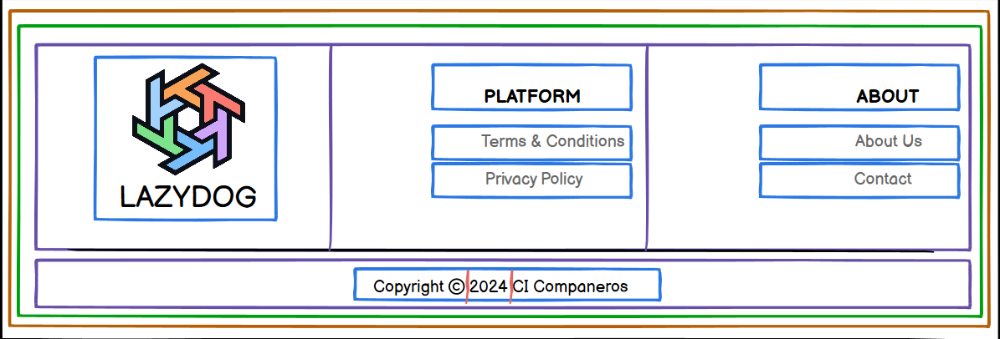

# Footer Component Guide

## Footer (Component)

### Purpose

The Footer component provides a consistent bottom section across all pages of the LazyDog application. It displays branding information, legal links, and contact information.

### State Management

The Footer component does *not* manage any state.

### Props

The Footer component does not require any props.  All content is static.

### Child Components

The Footer is composed of sub-components for better organization:

| Child Component      | Purpose                                             | Content Source                     |
|----------------------|------------------------------------------------------|-------------------------------------|
| `Logo`               | Displays the LazyDog logo.                              | Static asset                         |
| `CopyrightNotice`    | Displays the copyright notice.                          | Static text                         |
| `PlatformLinksSection` | Displays links related to the LazyDog platform.           | Static links                        |
| `AboutLinksSection`   | Displays links to "About Us" and "Contact" pages.          | Static links                        |

---

**Child Components of `PlatformLinksSection`:**

* `TermsAndConditionsLink`: Link to terms and conditions page.
* `PrivacyPolicyLink`: Link to privacy policy page.

**Child Components of `AboutLinksSection`:**

* `AboutUsLink`: Link to the about us page.
* `ContactLink`: Link to the contact page.

## Hierarchical Diagram

```bash
Footer
├── Logo
├── CopyrightNotice
├── PlatformLinksSection
│   ├── TermsAndConditionsLink
│   └── PrivacyPolicyLink
└── AboutLinksSection
    ├── AboutUsLink
    └── ContactLink
```

---

<details>
<summary><strong>Color System for color mapping</strong></summary>

<br>

   1. **🟧 Orange = Sections**  
      * Large areas dividing the page into logical parts (e.g., header, footer, main content).

   2. **🟩 Green = Groups of elements**  
      * Collections of related modules or components, such as the category buttons or the list of resource cards.

   3. **🟪 Purple = Modules (Self-contained units)**  
      * Complete components that combine several parts, such as a resource card or a widget. These function as cohesive, standalone units.

   4. **🟦 Blue = Parts of modules**  
      * The individual elements that make up a module, such as buttons, text, ratings, or links.

   5. **🟨 Yellow = Expandable areas**  
      * Dropdown menus and sections that can be shown/hidden based on user interaction.

   6. **🟥 Red = Dynamic content**  
      * Content that can update in real time (e.g., number of views, star ratings, user information).

</details>

<br>



---

## Communication Flow

The Footer component has no external communication. It renders static content.

## Styling

The Footer should have a consistent style across all pages, including responsive design for different screen sizes and potential theme adaptation (light/dark mode) based on `ThemeContext`.

---
