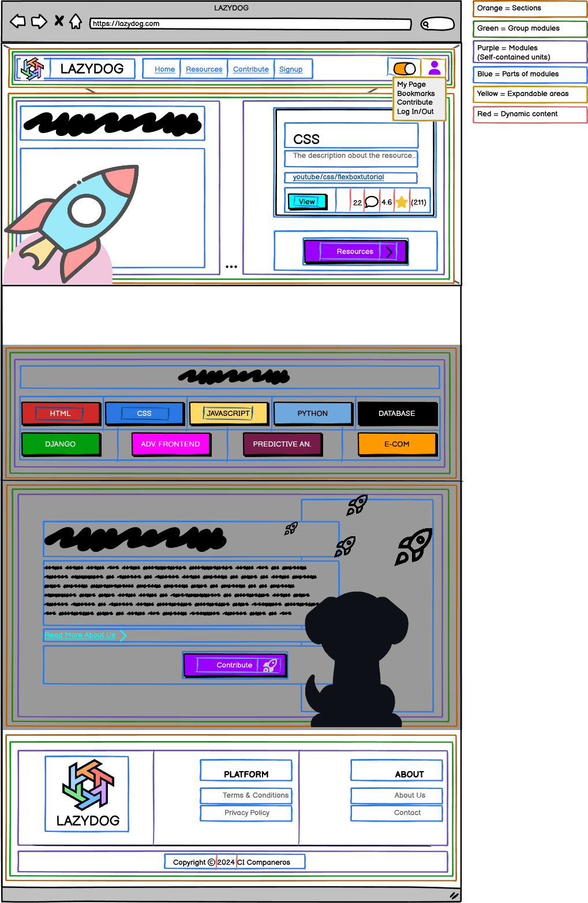

# Home Page Component Breakdown

## HomePage (Parent Component)

### Purpose

Main container for the home page, organizing layout and communication between child components.

### State Management (Using Context API)

- **`AuthContext`:** Manages user authentication state (`user` object).
- **`ThemeContext`:** Manages dark mode state (`darkMode` boolean).
- **Local State:** `carouselIndex` (number) for the hero carousel.

### Functions

- `onCarouselChange(index)`: Updates `carouselIndex`.

### Child Components

| Component       | Location                     | Props                                      | Purpose                                          |
|-----------------|------------------------------|-------------------------------------------|---------------------------------------------------|
| Navbar          | `/src/components/Navbar`    | `onNavigate` (React Router function)       | Navigation and user controls                      |
| HeroSection     | `/src/pages/HomePage/Hero` | `onNavigate`                               | Engaging hero section with carousel and CTA       |
| CategoriesSection| `/src/pages/HomePage/Categories` | `categories`, `onNavigate`                 | Displays resource categories                      |
| AboutSection    | `/src/pages/HomePage/About` | `onNavigate`                               | Introduces the platform and encourages contribution |
| Footer          | `/src/components/Footer`    | None                                       | Footer with legal and contact information        |

---

## Hierarchical Diagram

```bash
HomePage
├── Navbar
├── HeroSection
│   └── Carousel
├── CategoriesSection
├── AboutSection
└── Footer
```

---

<details>
<summary><strong>Color System for color mapping</strong></summary>

<br>

   1. **🟧 Orange = Sections**  
      * Large areas dividing the page into logical parts (e.g., header, footer, main content).

   2. **🟩 Green = Groups of elements**  
      * Collections of related modules or components, such as the category buttons or the list of resource cards.

   3. **🟪 Purple = Modules (Self-contained units)**  
      * Complete components that combine several parts, such as a resource card or a widget. These function as cohesive, standalone units.

   4. **🟦 Blue = Parts of modules**  
      * The individual elements that make up a module, such as buttons, text, ratings, or links.

   5. **🟨 Yellow = Expandable areas**  
      * Dropdown menus and sections that can be shown/hidden based on user interaction.

   6. **🟥 Red = Dynamic content**  
      * Content that can update in real time (e.g., number of views, star ratings, user information).

</details>

<br>



---

## Communication Flow

- `HomePage` manages the carousel index.
- `AuthContext` and `ThemeContext` provide user and dark mode data.
- Navigation is handled by React Router.
- Data flows down minimally via props, primarily for navigation callbacks.

---
